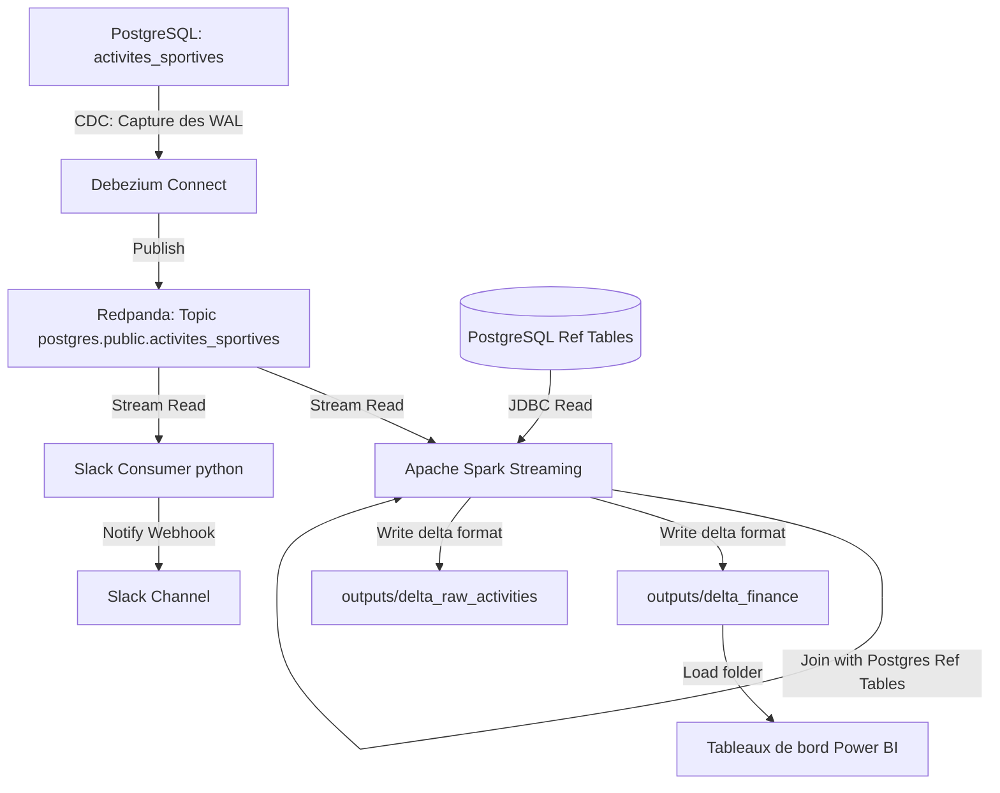

# POC Avantages Sportifs - Architecture de Streaming Temps Réel

## Objectif

L'objectif est d'évaluer la faisabilité technique d'une solution encourageant l'activité physique des salariés via des incitations financières (prime sportive) et des congés supplémentaires (jours bien-être).

Dans cette version, l'architecture a été migrée d'un mode batch (ELT avec dbt) vers une **architecture de streaming en temps réel** reposant sur le Change Data Capture (**CDC** avec **Debezium**), un bus de messages (**Redpanda/Kafka**), un moteur de calcul en streaming (**Spark**), un lac de données (**Delta Lake**) et un outil de notification (**Slack**)

Les objectifs du pipeline sont :
- Capturer chaque nouvelle activité sportive (simulée comme Strava) dès son insertion dans PostgreSQL.
- Streamer ces événements en direct via **Debezium** et **Redpanda**.
- Traiter, nettoyer, joindre les données avec les référentiels RH, et calculer l'impact financier en continu avec **Apache Spark Streaming**.
- Écrire les indicateurs calculés au format **Delta Lake** (fichiers Parquet versionnés) pour **Power BI**.
- Envoyer des alertes Slack en temps réel pour féliciter les salariés à chaque activité sportive enregistrée.

---

## Architecture Technique



---

## Structure du Projet

```text
.
├── scripts/
│   ├── init_db.py            # Initialisation des tables brutes de référentiels (RH, Sport)
│   ├── simulate_strava.py    # Générateur d'activités sportives simulées dans Postgres
│   ├── calculate_distances.py# Validation des distances avec l'API Google Maps
│   ├── register_debezium.py  # Script d'enregistrement du connecteur CDC auprès de Debezium
│   ├── spark_stream_transform.py # Job Spark Streaming principal (calculs et Delta Lake)
│   ├── slack_stream_consumer.py  # Consommateur léger d'alerte Slack en temps réel
│   └── docker-compose.yml    # Orchestration Docker (Redpanda, Debezium, Spark-Streaming)
├── outputs/
│   ├── delta_finance/        # Table Delta Lake finale (calculs financiers pour Power BI)
│   ├── delta_raw_activities/ # Table Delta Lake brute contenant toutes les activités
│   └── checkpoint_finance/   # Fichiers de checkpoint pour Spark Structured Streaming
├── test_analyse_donnees.py   # Tests unitaires du projet
├── requirements.txt          # Dépendances Python locales
├── .env                      # Configuration locale (Postgres, Slack, etc.)

```

---

## Installation et Configuration

### 1. Environnement Python local
Créer et activer un environnement virtuel :
```powershell
python -m venv .venv
.venv\Scripts\Activate.ps1
```

Installer les dépendances requises (notamment `pyspark`, `delta-spark` et `kafka-python-ng`) :
```powershell
pip install -r requirements.txt
```

### 2. Variables d'environnement (`.env`)
Créez un fichier `.env` à la racine avec nos accès locaux.

### 3. Configuration de la réplication logique PostgreSQL
Pour que Debezium Connect puisse capturer les transactions PostgreSQL, nous devons activer le mode de réplication logique :
1. Ouvrir le fichier de configuration de notre instance locale : 
`C:\Program Files\PostgreSQL\18\data\postgresql.conf`.
2. Définir la ligne suivante (décommenter si nécessaire) :
   ```ini
   wal_level = logical
   ```
3. Redémarrer le service Windows **`postgresql-x64-18`** depuis une console PowerShell en tant qu'administrateur :
   ```powershell
   Restart-Service postgresql-x64-18
   ```

---

## Lancement du Pipeline de Streaming

### Étape 1 : Démarrer l'infrastructure Docker
Lancer les conteneurs Redpanda, Debezium Connect et le moteur Spark Streaming :
```powershell
docker compose -f scripts/docker-compose.yml up -d
```

### Étape 2 : Initialiser la base de données PostgreSQL
Insérer les données RH et sportives d'origine :
```powershell
python scripts/init_db.py
python scripts/calculate_distances.py
```

### Étape 3 : Enregistrer le connecteur CDC Debezium
Déclarer la table `activites_sportives` auprès de Debezium Connect :
```powershell
python scripts/register_debezium.py
```

### Étape 4 : Lancer le consommateur d'alertes Slack
Dans un terminal distinct, lancer le consommateur temps réel pour envoyer les notifications Slack :
```powershell
.venv\Scripts\python scripts\slack_stream_consumer.py
```

### Étape 5 : Simuler des activités sportives (Génération de données)
Exécuter la simulation pour générer les activités Strava. Debezium va immédiatement capturer les écritures et les transmettre à Redpanda, déclenchant ainsi le traitement Spark et les alertes Slack :
```powershell
python scripts/simulate_strava.py
```

---

## Restitution dans Power BI

Le job Spark Streaming met à jour de façon atomique la table finale **Delta Lake** dans `outputs/delta_finance/`. 

Pour brancher notre tableau de bord Power BI :
1. Dans Power BI Desktop, sélectionnez **Obtenir les données** -> **Dossier** (Folder).
2. Choisissez le chemin local : **`C:\---\Projet_12\outputs\delta_finance`**.
3. Chargez les fichiers Parquet consolidés. Toute nouvelle activité ingérée par le pipeline de streaming mettra à jour ce dossier à la volée.
