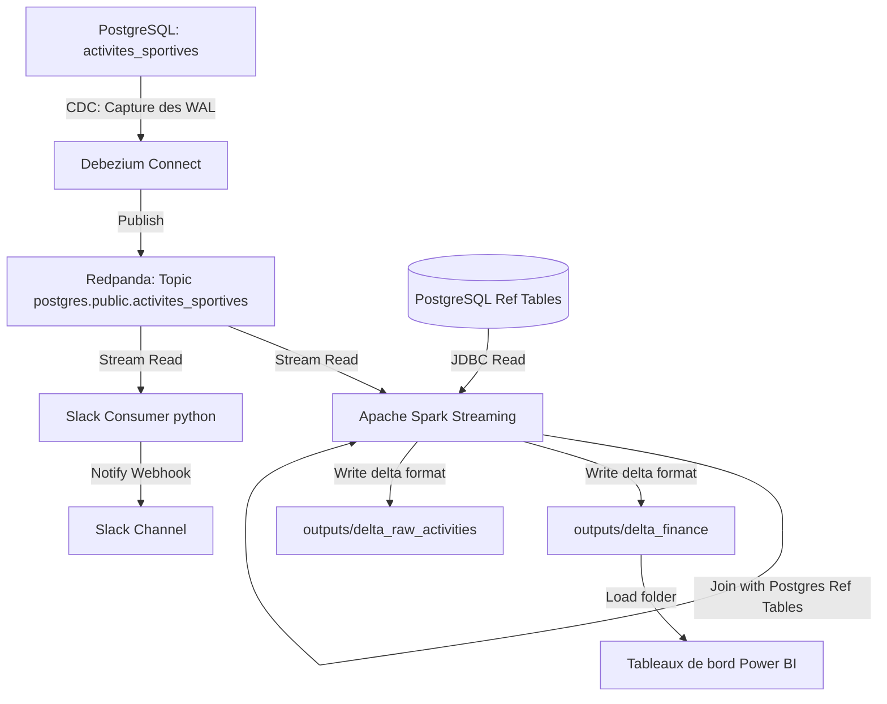

# POC Avantages Sportifs - Architecture de Streaming Temps Réel

## Contexte du Projet

Le programme **"Avantages Sportifs"** est une initiative d'entreprise visant à encourager l'activité physique et à favoriser les mobilités douces des collaborateurs. Ce programme propose deux incitations majeures :
1. **Une prime sportive** équivalente à **5% du salaire brut** pour les salariés utilisant un moyen de transport actif (marche, vélo, trottinette) de manière non suspecte.
2. **Des jours de repos supplémentaires (Jours Bien-être)** : 5 jours de congés accordés dès que le salarié réalise au moins **15 activités sportives** sur l'année.

## Objectifs du POC

Ce POC valide techniquement le passage d'une architecture batch traditionnelle vers une **architecture événementielle et de streaming en temps réel** reposant sur le Change Data Capture (**CDC**). 

Le pipeline mis en œuvre remplit les objectifs suivants :
* **Capture temps réel (CDC)** : Détecter instantanément l'insertion de chaque activité sportive dans PostgreSQL via **Debezium Connect**.
* **Transport de données** : Acheminer les événements de manière ordonnée et résiliente dans un bus de messages **Redpanda** (compatible Kafka).
* **Streaming & Calculs à la volée** : Consommer le flux avec **Apache Spark Streaming** pour valider les distances (via l'API Google Maps), joindre les référentiels RH et calculer le budget de la prime et des Jours Bien-être en continu.
* **Stockage structuré** : Écrire les résultats au format ouvert **Delta Lake** (Parquet avec transactions ACID) pour rafraîchir les rapports financiers dans **Power BI** sans latence.
* **Alerte & Animation** : Publier instantanément des notifications de félicitations personnalisées sur un canal **Slack** à chaque séance de sport.

---

## Architecture Technique



---

## Structure du Projet

```text
.
├── scripts/
│   ├── init_db.py            # Initialisation des tables brutes de référentiels (RH, Sport)
│   ├── simulate_strava.py    # Générateur d'activités sportives simulées dans Postgres
│   ├── calculate_distances.py# Validation des distances avec l'API Google Maps
│   ├── register_debezium.py  # Script d'enregistrement du connecteur CDC auprès de Debezium
│   ├── spark_stream_transform.py # Job Spark Streaming principal (calculs et Delta Lake)
│   ├── slack_stream_consumer.py  # Consommateur léger d'alerte Slack en temps réel
│   └── docker-compose.yml    # Orchestration Docker (Redpanda, Debezium, Spark-Streaming)
├── dbt_avantages_sportifs/    # Projet dbt Core pour la modélisation historique (PostgreSQL)
├── kestra/                    # Workflows et scripts d'orchestration (analyse_donnees.yml)
├── outputs/
│   ├── delta_finance/        # Table Delta Lake finale (calculs financiers pour Power BI)
│   ├── delta_raw_activities/ # Table Delta Lake brute contenant toutes les activités
│   └── checkpoint_finance/   # Fichiers de checkpoint pour Spark Structured Streaming
├── test_analyse_donnees.py   # Tests unitaires du projet
├── requirements.txt          # Dépendances Python locales
├── .env                      # Configuration locale (Postgres, Slack, etc.)
```

---

## Installation et Configuration

### 1. Environnement Python local
Créer et activer un environnement virtuel :
```powershell
python -m venv .venv
.venv\Scripts\Activate.ps1
```

Installer les dépendances requises (notamment `pyspark`, `delta-spark` et `kafka-python-ng`) :
```powershell
pip install -r requirements.txt
```

### 2. Variables d'environnement (`.env`)
Créer un fichier `.env` à la racine avec nos accès locaux.

---

## Lancement du Pipeline de Streaming

### Étape 1 : Démarrer l'infrastructure Docker
Lancer les conteneurs Redpanda, Debezium Connect et le moteur Spark Streaming :
```powershell
docker compose -f scripts/docker-compose.yml up -d
```

### Étape 2 : Initialiser la base de données PostgreSQL
Insérer les données RH et sportives d'origine :
```powershell
python scripts/init_db.py
python scripts/calculate_distances.py
```

### Étape 3 : Enregistrer le connecteur CDC Debezium
Déclarer la table `activites_sportives` auprès de Debezium Connect :
```powershell
python scripts/register_debezium.py
```

### Étape 4 : Lancer le consommateur d'alertes Slack
Dans un terminal distinct, lancer le consommateur temps réel pour envoyer les notifications Slack :
```powershell
.venv\Scripts\python scripts\slack_stream_consumer.py
```

### Étape 5 : Simuler des activités sportives (Génération de données)
Exécuter la simulation pour générer les activités Strava. Debezium va immédiatement capturer les écritures et les transmettre à Redpanda, déclenchant ainsi le traitement Spark et les alertes Slack :
```powershell
python scripts/simulate_strava.py
```

---

## Orchestration des Tâches avec Kestra

Pour simplifier et automatiser l'exécution, l'ensemble des scripts et traitements du projet est orchestré par le workflow **Kestra** défini dans **`kestra/analyse_donnees.yml`**. 

Ce workflow gère automatiquement l'enchaînement et le monitoring des tâches suivantes :
1. **Initialisation de la base** (`init_db.py`) : Création et alimentation des tables de référence.
2. **Calcul des distances domicile-travail** (`calculate_distances.py`) : Interrogation de l'API Google Maps et détection des trajets suspects.
3. **Simulation Strava** (`simulate_strava.py`) : Génération des activités sportives pour les collaborateurs.
4. **Validation de la qualité (GX)** (`validate_data_gx.py`) : Validation stricte des données avec Great Expectations.
5. **Transformation décisionnelle (dbt)** : Compilation et exécution des modèles SQL dans PostgreSQL pour calculer les primes.
6. **Exportation des résultats** (`export_dbt_outputs.py`) : Extraction des données transformées pour Power BI.
7. **Alerte Slack** (`notify_slack.py`) : Envoi des messages de félicitations pour animer le programme.

---

## Restitution dans Power BI

Le tableau de bord Power BI est connecté directement au dossier local `outputs/delta_finance/` au format Delta Lake. Les indicateurs de ce dossier sont mis à jour à la volée par le pipeline de streaming, permettant une actualisation en temps réel des graphiques financiers et RH.
